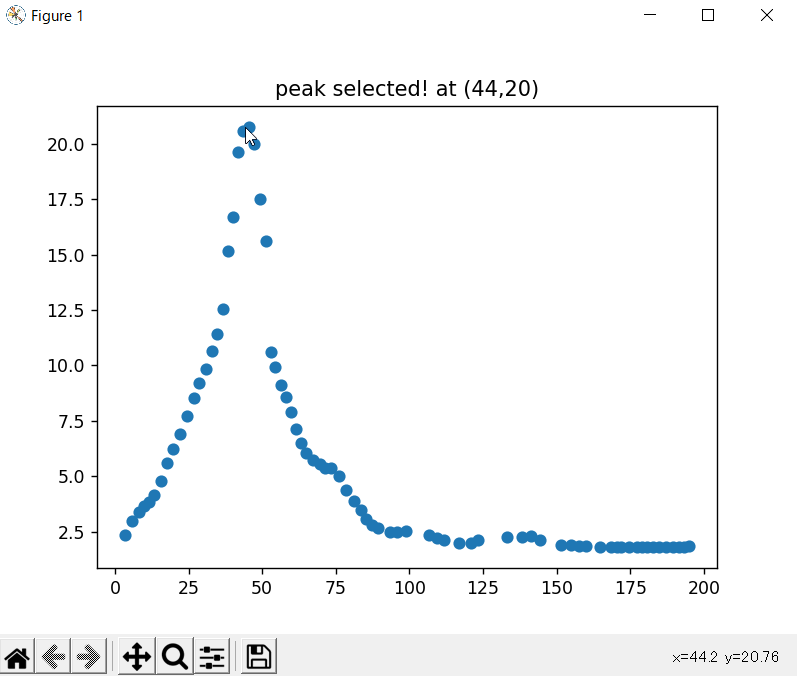
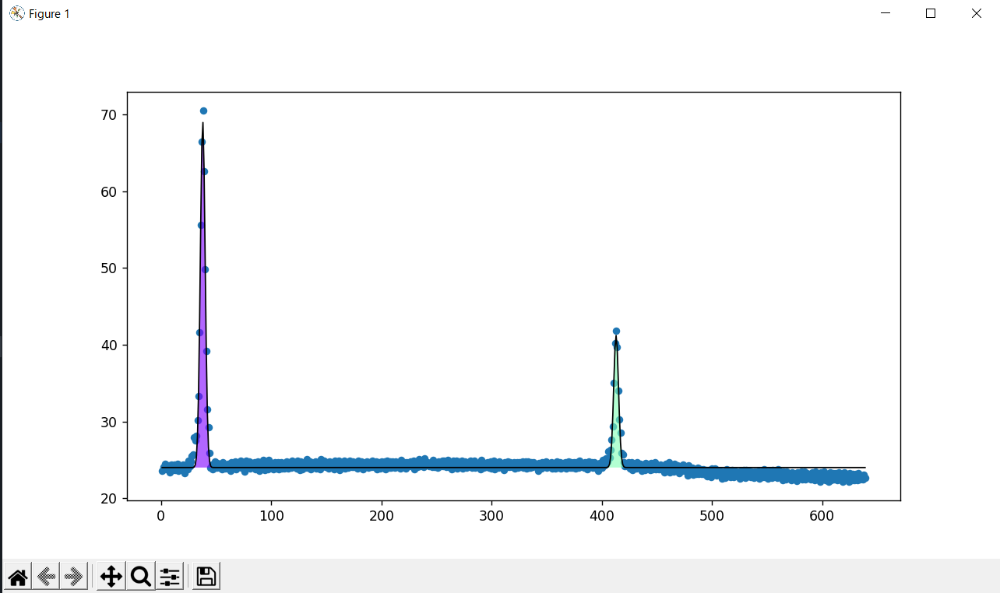

# iFindPeaks
This project focuses on finding peaks.
iFindPeaks can find optional number of peaks and return x,y of each peaks from the variety of spectrum data.

### [spectrum data format must be like the table below]

x | y
--- | ---
0 | 1
1 | 13
2 | 30
3 | 43
4 | 31
5 | 11
...|...

### <b>[New Feature!]</b>

#### <b> Interactive peak determination </b>
Now you can obtain x,y of a peak with the help of interactive peak guess!

### <b> bmp imgae file to csv converting </b>
You can now directly find peaks from images(holds any spectrum information) with interactive.py without additional hassle of converting bmp image into csv file.

Notice: file format of the image must be bmp(.bmp, .jpg, .png, .jpeg). vector images isn't supported!

### [Available approximation curve]

- gaussian function
- polynomial function

### [Curent supectrum data files supoort]
.asc .csv .txt 
bmp formatted image(.bmp .jpg .png .jpeg)

### [Future suepctrum data files support]
Excel sheet
table of html

### [Future features!]

* AI peak shape guess
* interactive peak determination (under development!)
