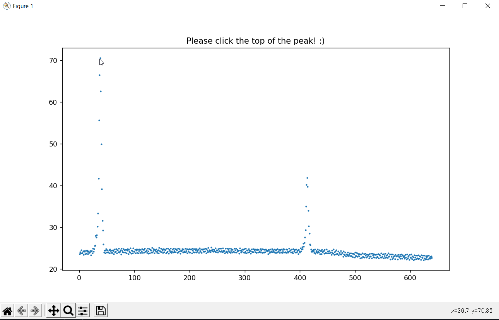
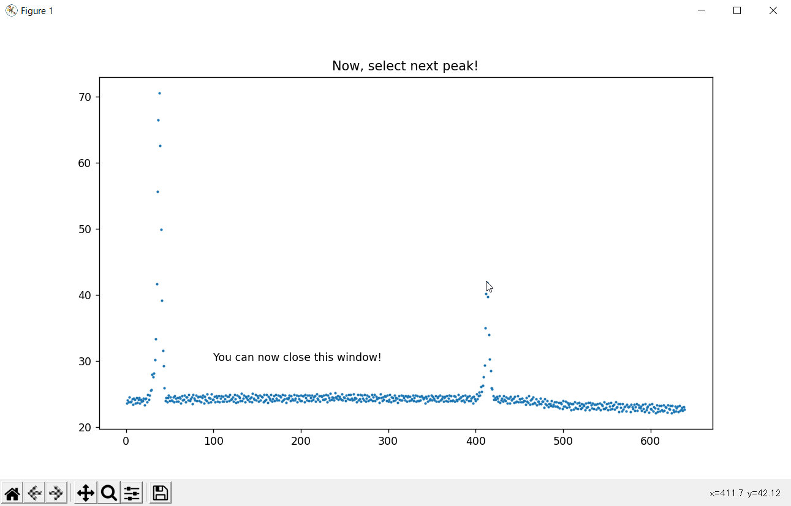

# iFindPeaks
This project focuses on finding peaks.
iFindPeaks can find optional number of peaks and return x,y of each peaks from the variety of spectrum data.

### [spectrum data format must be like the table below]

x | y
--- | ---
0 | 1
1 | 13
2 | 30
3 | 43
4 | 31
5 | 11
...|...

### <b>[New Feature!]</b>

#### <b> Interactive peak determination </b>
Now you can obtain x,y of each peak on the spectrum with [interactive.py](interactive.py)

### <b> bmp image file to csv converting </b>
You can now directly find peaks from the image(holds any spectrum information) by [interacive.py](interactive.py) without additional hassle of converting bmp images into csv files.

Notice: file format of the image must be bmp(.bmp, .jpg, .png, .jpeg). Vector format isn't supported!

### [Available approximation curve]

- gaussian function
- polynomial function

### [Curent supectrum data files supoort]
* ascii file(.asc .csv .txt etc..)
* bmp formatted image(.bmp .jpg .png .jpeg etc..)

### [Future suepctrum data files support]
* Excel sheet
* table of html

### [Future features!]

* AI peak shape guess
* interactive peak determination (under development! you can try a little bit of this func with interactive.py)
