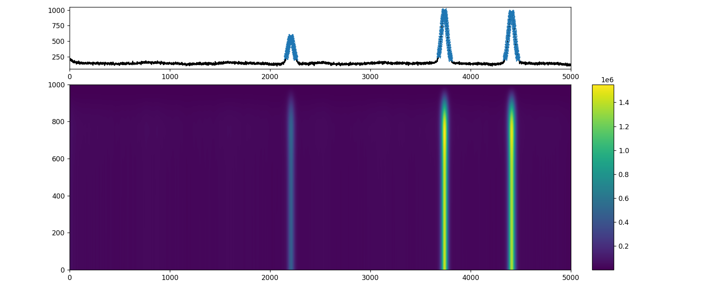
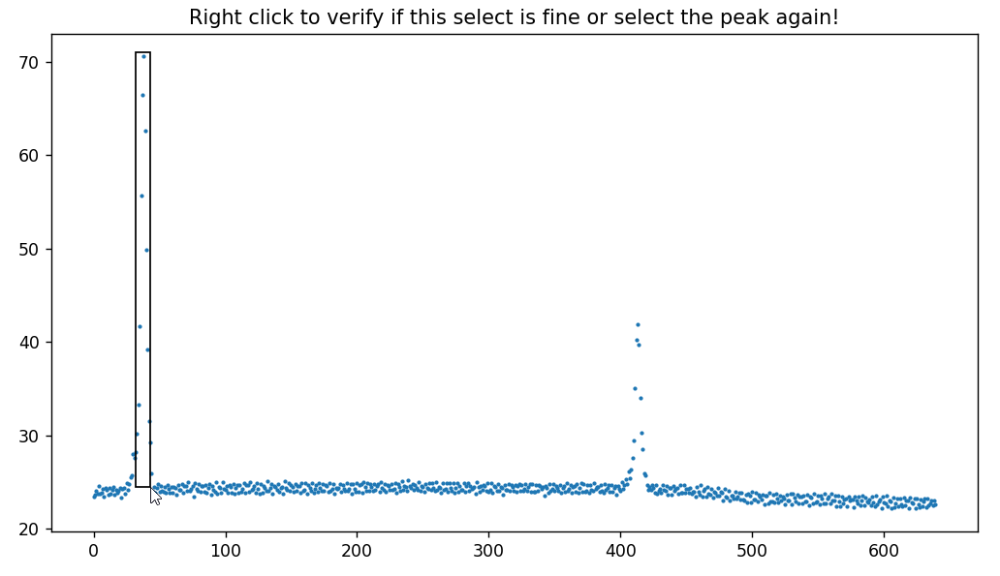
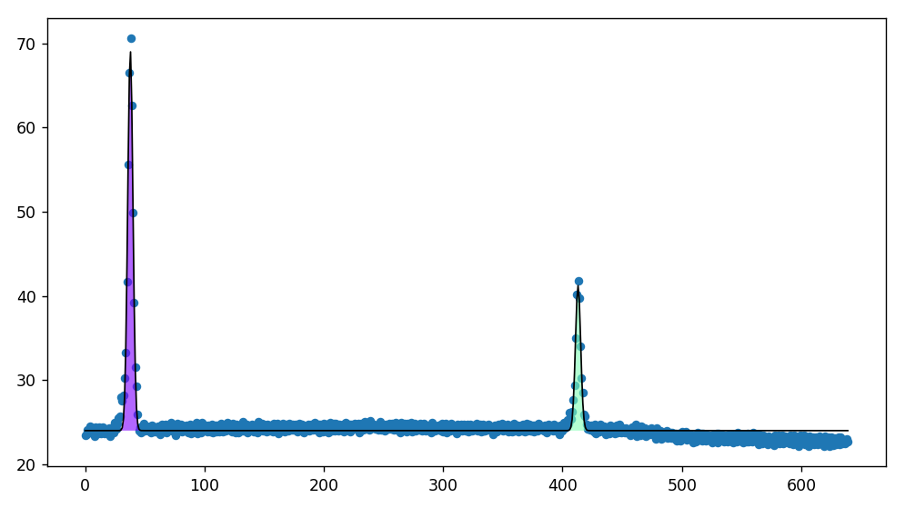
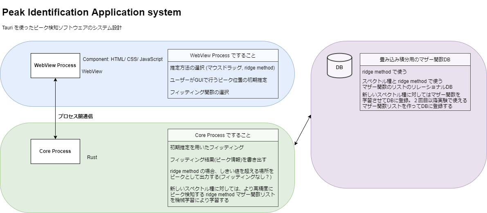

# <b>Find Peaks</b>
Python library for identifying the peaks using wavelet transform.

## <b>Features</b>

1. <b>Peak identification by wavelet transform</b>

    - An example of output  
        
        (each blue areas represent the detected peaks)

1. <b>Simulated spectrum dataset generation</b>

    

1. <b>Peak identification for labeling existing data on GUI</b>

    You can obtain x,y of each peaks on each spectrums by [interactive.py](interactive.py)

    Available method
    - click (click the top and the both edges of each peaks)
    - drag (wrap up each peaks)

    An example of labelling right peak positons by mouse dragging
    
      (each labelled peaks are fitted by gaussian function)

## <b>Future Updates</b>

1. <b>Peak identification using CNN(Convolutional Neural Network) and wavelet</b>

    we will reformulate the current approach by wavelet transform as a trainable CNN to increase its detection accuracy and generalization.

1. <b>Porting to Rust from scratch</b>

    After our peak identification algorhythms gain its enough accuracy and generalization to unseen data, then we will port the programs to Rust before kicking off the development of the GUI application.

1. <b>GUI application</b>

