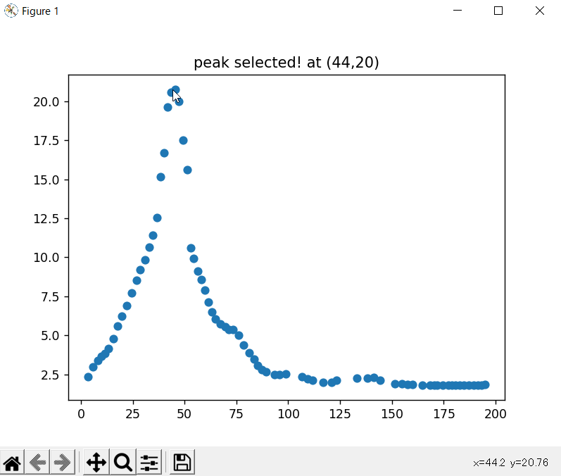
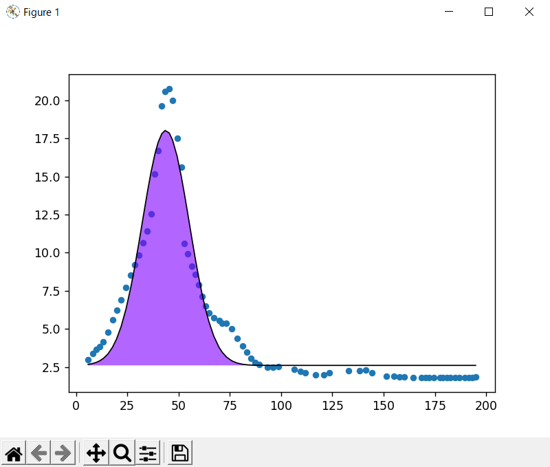

# iFindPeaks
This project focuses on finding peaks.
iFindPeaks can find optional number of peaks and return x,y of each peaks from the variety of spectrum data.

### [spectrum data format should be like]

x | y
--- | ---
0 | 1
1 | 13
2 | 30
3 | 43
4 | 31
5 | 11
...|...

### <b>[New Feature!]</b>

#### <b> Interactive peak determine </b>
Now you can obtain x,y of a peak with the help of interactive peak guession!

### [Available approximation curve]

- gaussian function
- polynomial function

### [Curent supectrum data files supoort]
.asc .csv .txt

### [Future suepctrum data files support]
.asc .csv .xlsx .xls .pickle .txt .html(table)

### [Future features!]

* AI peak guess
* interactive peak determine